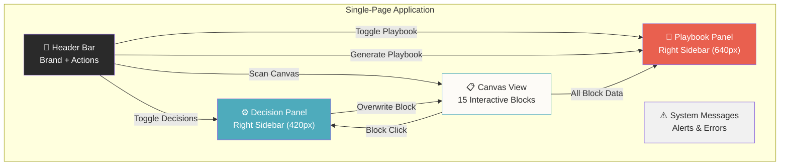

# Content & Copywriting Inventory — UCC-SMC

**Application:** UnCommon Core Strategy Model Canvas
**Audit Date:** 2026-05-30
**Purpose:** Complete catalog of all user-facing copy, organized by site architecture

---

## 1. Site Architecture Map

### Architecture Zones

| Zone | Type | Width | Position | Content Role |
|------|------|-------|----------|-------------|
| Header Bar | Fixed top bar | Full width | Top | Navigation, branding, primary actions |
| Canvas View | Main content | 1000×1400px canvas | Center | User input, strategy visualization |
| Decision Panel | Slide-in sidebar | 420px | Right | Guided strategy selection |
| Playbook Panel | Slide-in sidebar | 640px | Right | AI output display |
| System Messages | Modal alerts | N/A | Overlay | Error/success feedback |

---

## 2. Copy by Zone

### 2.1 Header Bar

| Element | Type | Default State | Loading State | Notes |
|---------|------|---------------|---------------|-------|
| Brand (left) | Static text | `UCC` `SMC` | — | "UCC" in dark, "SMC" in cyan (#4EABBC) |
| Student Input | Placeholder | `Student Name...` | — | Unbounded text input |
| Import Button | Button + Icon | `Import` | — | Upload icon (↑) |
| Export Button | Button + Icon | `Export` | — | Download icon (↓) |
| Scan Canvas | Label Button | `Scan Canvas` | `Scanning...` | Cyan bg; accepts image files |
| Generate Playbook | Button | `Generate Playbook` | `Generating...` | Red/orange bg |
| Decision Toggle | Icon Button | — | — | Tooltip: `Toggle Decisions` |
| Playbook Toggle | Icon Button | — | — | Tooltip: `Toggle Playbook` |

### 2.2 Canvas — Block Labels

| # | Block ID | Display Label | Color | Position |
|---|----------|--------------|:-----:|----------|
| 1 | `educational_vision` | Educational Vision | 🔴 `#E9604F` | Roof (triangle) |
| 2 | `teaching_approach` | Teaching Approach | 🔵 `#4EABBC` | Row 2 Left |
| 3 | `child_interests` | Child's Interests | 🔴 `#E9604F` | Row 2 Right |
| 4 | `learning_materials` | Learning Materials | 🔵 `#4EABBC` | Row 3 |
| 5 | `physical_activities` | Physical Activities | 🔵 `#4EABBC` | Row 3 |
| 6 | `social_efforts` | Socializing Efforts | 🔵 `#4EABBC` | Row 3 |
| 7 | `communication_style` | Communication Style | 🔵 `#4EABBC` | Row 3 |
| 8 | `child_learning_style` | Child Learning Style | 🔵 `#4EABBC` | Row 3 |
| 9 | `technology_use` | Technology Use | 🔵 `#4EABBC` | Row 4 |
| 10 | `enrichment_programs` | Enrichment Programs | 🔵 `#4EABBC` | Row 4 |
| 11 | `self_confidence` | Self Confidence Building | 🔴 `#E9604F` | Row 4-5 (tall) |
| 12 | `family_beliefs` | Family Beliefs | 🔵 `#4EABBC` | Row 4 |
| 13 | `learning_environment` | Learning Environments | 🔵 `#4EABBC` | Row 4 |
| 14 | `resources_committed` | Resources Commitment | 🔴 `#E9604F` | Row 5 Left |
| 15 | `parents_expectations` | Parent's Expectations | 🔴 `#E9604F` | Row 5 Right |

### Canvas Placeholders

| Block Type | Placeholder Text |
|-----------|-----------------|
| Regular blocks (14) | `Type here...` |
| Educational Vision (roof) | `Describe your vision...` |

### 2.3 Decision Panel

#### Panel Chrome Copy

| Element | Text |
|---------|------|
| Panel title | `Decision Panel` |
| Panel subtitle | `Tap squares to map reality. Overwrite block when ready.` |
| Draft section title | `DRAFT TEXT` |
| Draft textarea placeholder | `Selections will generate text here...` |
| Copy button | `Copy Draft` |
| Overwrite button | `Overwrite Block` |

#### Educational Vision — Special State

| Element | Text |
|---------|------|
| Empty state message | `Educational Vision is synthesized from all other blocks.` |
| Synthesis button (default) | `Synthesize Vision` |
| Synthesis button (loading) | `Synthesizing...` |

#### Block Explainers (15)

These appear at the top of the Decision Panel when a block is selected:

| Block | Explainer Copy |
|-------|---------------|
| Educational Vision | Why you're doing this. The future-you you're building toward. If this isn't clear, everything else is just busywork. |
| Teaching Approach | How learning actually happens here. Methods beat intentions. Pick how you teach, or chaos will pick for you. |
| Learning Materials | What the student touches: books, videos, apps, tools. This is the fuel. Bad inputs = bad thinking. |
| Technology Use | Where screens help and where they hurt. Tech should multiply thinking, not replace it. |
| Enrichment Programs | The extras that turn curiosity into skill. Clubs, projects, mentors, weird stuff that makes learning stick. |
| Physical Activities | Bodies power brains. If the body is bored, the mind will be too. |
| Resources Commitment | Time, money, energy. What you're actually willing to invest—not what you wish you would. |
| Self Confidence Building | How the student learns to try, fail, and try again. Confidence is trained, not gifted. |
| Socializing Efforts | How the student practices being human: friends, teamwork, conflict, cooperation. |
| Child's Interests | What pulls them in naturally. Interest is the strongest learning accelerator you have. |
| Communication Style | How feedback flows between student and adults. Praise, correction, boundaries. If this breaks, learning breaks. |
| Child Learning Style | How this learner actually processes information. One size never fits all. |
| Learning Environments | Where learning happens. Chaos or calm? Distraction or focus? Space shapes behavior. |
| Family Beliefs | The values running this learning system. What gets rewarded, tolerated, and ignored shows up here. |
| Parent's Expectations | What success really means here. If this is fuzzy, pressure leaks into everything. |

### 2.4 Playbook Panel

| Element | Text |
|---------|------|
| Panel header title | `Strategy Playbook` |
| Empty state title | `No Playbook Generated` |
| Empty state description | `Complete the canvas and click "Generate Playbook" to build your strategy.` |
| Copy button | `Copy Markdown` |
| Export button | `Export .md` |
| Copy success alert | `Markdown Playbook copied to clipboard!` |

### 2.5 System Messages

| Trigger | Message | Type |
|---------|---------|------|
| Generate Playbook with no student name | `Please enter a student name first.` | Warning |
| Synthesize Vision with empty blocks | `Please fill in some input blocks first.` | Warning |
| Image scan API failure | `Failed to scan image. Please ensure the API key is valid and try again.` | Error |
| Playbook generation failure | `Generation failed. Check console for details.` | Error |
| Vision synthesis failure | `Failed to synthesize vision.` | Error |
| Playbook copied to clipboard | `Markdown Playbook copied to clipboard!` | Success |

---

## 3. Complete Decision Grid Copy Reference

### 168 Decision Squares (14 blocks × 3 grids × 4 options)

#### Teaching Approach

| Grid | Label | Text |
|------|-------|------|
| **Content Control** | Parent Led | Instruction is 100% parent-led and structured. |
| | Guided Choice | Parent defines the scope; student chooses the sequence. |
| | Student Led | Student initiates topics; parent facilitates resources. |
| | Collaborative | Learning is a shared project-based dialogue. |
| **Pacing** | Fixed Schedule | Follow a strict time-based daily routine. |
| | Mastery Based | Move forward only when the concept is fully owned. |
| | Cyclic | Deep dives followed by periods of rest and reflection. |
| | Flow State | Work until the natural energy for the task dissipates. |
| **Feedback Method** | Quantitative | Use scores and data to track progress. |
| | Qualitative | Use verbal reviews and reflective journals. |
| | Portfolio | Success is measured by the quality of finished work. |
| | Demonstration | Student 'teaches back' to prove understanding. |

#### Learning Materials

| Grid | Label | Text |
|------|-------|------|
| **Primary Medium** | Physical Books | Primary focus on analog, high-quality print materials. |
| | Digital Core | Leverage curated apps and online platforms. |
| | First-Hand | Focus on primary sources, nature, and raw artifacts. |
| | Hybrid | Strategic mix of screen-based and paper-based tools. |
| **Curation Philosophy** | All-in-One | Use a pre-designed, comprehensive curriculum. |
| | Eclectic | Hand-pick the best tool for each specific subject. |
| | Living Books | Avoid textbooks; use high-quality literature only. |
| | Minimalist | Fewer tools, used more deeply and repeatedly. |
| **Input Quality** | Classic | Focus on the 'Great Books' and timeless ideas. |
| | Modern | Prioritize current science, tech, and global trends. |
| | Functional | Focus on materials with immediate real-world utility. |
| | Expressive | Focus on tools that allow for creation and output. |

#### Technology Use

| Grid | Label | Text |
|------|-------|------|
| **Device Role** | Pure Tool | Technology is only for specific utility (math, coding). |
| | Portal | Tech is the gateway to global lectures and experts. |
| | Creative Hub | Used primarily for video editing, design, or music. |
| | Low-Tech | Deliberate restriction of screens to prevent fatigue. |
| **Consumption Ratio** | Watch/Read | Tech used for high-quality passive intake (documentaries). |
| | Interact | Tech used for interactive sims and dynamic learning. |
| | Output Only | Screens only go on when the student is producing work. |
| | Balanced | Controlled mix of learning intake and creative output. |
| **AI Integration** | AI Tutor | AI used as a personalized Socratic guide. |
| | Research | AI used to synthesize large amounts of data quickly. |
| | Analog Only | AI is restricted to maintain fundamental skills. |
| | Logic/Code | AI used to help build and debug student projects. |

#### Child's Interests

| Grid | Label | Text |
|------|-------|------|
| **Interest Mapping** | Generalist | Explore many surface-level topics to find a spark. |
| | Specialist | Go deep into one obsession for months or years. |
| | Seasonal | Shift core focus every 6-8 weeks based on whim. |
| | Anchored | Tie all core subjects to one primary interest. |
| **Choice Level** | Full Freedom | Student decides 100% of the interest-based time. |
| | The Menu | Parent offers 3-4 viable paths; student picks one. |
| | Earned Choice | Interest time is 'unlocked' by finishing core work. |
| | Negotiated | Interests are pursued in partnership with parent goals. |
| **Output of Interest** | Enjoyment | The goal is pure engagement and curiosity. |
| | Skill Building | Turn interests into measurable, useful capabilities. |
| | Exhibition | Interests must lead to a public show, talk, or blog. |
| | Entreprenuer ⚠️ | Experiment with turning the interest into a business. |

#### Physical Activities

| Grid | Label | Text |
|------|-------|------|
| **Activity Type** | Team Sports | Focus on competition, cooperation, and social play. |
| | Outdoor/Wild | Hiking, climbing, and interacting with the elements. |
| | Strength/Skill | Martial arts, gymnastics, or lifting for discipline. |
| | Functional | Walking, gardening, and daily chores as movement. |
| **Discipline Level** | Free Play | Activity is unstructured and driven by the child's mood. |
| | Consistent | Physical work happens at the same time every day. |
| | High Effort | Pushing limits and tracking physical performance. |
| | Movement Breaks | Short bursts of activity every hour of study. |
| **Mental Connection** | Mental Rest | Exercise is a 'brain break' from intellectual work. |
| | Character | Using physical hardship to build mental endurance. |
| | Connection | Activity is the primary time for making friends. |
| | Complex Skill | Focus on learning difficult physical patterns (dance). |

#### Socializing Efforts

| Grid | Label | Text |
|------|-------|------|
| **Peer Group** | Similar Age | Socializing primarily with kids of the same age/grade. |
| | Multi-Generational | Focus on mixed-age groups and interacting with adults. |
| | Community | Focus on local service and neighborhood belonging. |
| | Interest-Based | Finding peers through shared obsessions and hobbies. |
| **Frequency** | Daily Social | High-frequency interaction is essential every day. |
| | Deep & Sparse | Fewer, but longer and more intense social sessions. |
| | Event Driven | Focus on meetups, co-ops, and organized events. |
| | Family First | Prioritize sibling and extended family bonds. |
| **Skill Focus** | Harmony | Focus on empathy, kindness, and conflict avoidance. |
| | Debate/Logic | Socializing as a place to test ideas and challenge others. |
| | Leadership | Taking responsibility for organizing others. |
| | Solitude | Learning to be social when needed, but happy alone. |

#### Communication Style

| Grid | Label | Text |
|------|-------|------|
| **Feedback Loop** | Direct/Blunt | Feedback is clear, objective, and unemotional. |
| | Gentle/Coaching | Focus on encouragement and soft corrections. |
| | Discussion | Feedback is a two-way street; student critiques parent. |
| | Periodic | Weekly reviews rather than constant daily correction. |
| **Conflict Strategy** | Cool Off | Walk away when things heat up; talk only when calm. |
| | Immediate | Resolve issues as they happen to prevent resentment. |
| | Mediation | Use a neutral 'third thing' (rules/values) to decide. |
| | Logical Consequences | Actions have built-in results; talk is secondary. |
| **Authority Tone** | Partnership | We are equals on a journey; decisions are consensus. |
| | Mentor/Apprentice | I have the map, but you are the one walking the path. |
| | The Captain | Clear hierarchy; parent makes the tough calls. |
| | Coach | I ask the questions; you find the answers. |

#### Child Learning Style

| Grid | Label | Text |
|------|-------|------|
| **Input Preference** | Visual | Learn best through diagrams, charts, and video. |
| | Auditory | Learn through lectures, discussion, and audiobooks. |
| | Hands-On | Must touch, build, and move to understand. |
| | Logical/Math | Prefer abstract systems, codes, and logic. |
| **Processing Environment** | Solitary | Needs quiet, alone time to digest new info. |
| | Interactive | Processes thoughts by talking them out with others. |
| | Ambient | Works better with background noise and activity. |
| | Variable | Environment must change based on task difficulty. |
| **Novelty Seeking** | Consistency | High comfort in repetition and predictable patterns. |
| | Novelty | Needs frequent shifts in topic and method to stay alert. |
| | Deep Dive | Stay on one topic until it is mastered, no matter what. |
| | Horizontal | Prefer connecting many different ideas at once. |

#### Learning Environment

| Grid | Label | Text |
|------|-------|------|
| **Spatial Vibe** | Minimalist | Clean, empty surfaces; low visual clutter. |
| | Resource Rich | Surrounded by books, art supplies, and tools. |
| | No Desk | Learning happens anywhere: couch, floor, park. |
| | Formal | Dedicated 'school room' or desk to signal focus. |
| **Sensory Input** | Silent | Deep silence is required for intellectual work. |
| | Soundscape | Uses music or ambient noise to mask distractions. |
| | Natural Light | Prioritize being near windows or outdoors. |
| | Tactile | Focus on comfort: blankets, soft chairs, fidgets. |
| **Ownership** | Communal | Learning happens in the heart of the home (kitchen). |
| | Private Den | Child has absolute control over their own workspace. |
| | The World | The primary environment is the city, museum, or forest. |
| | Rotating | Move between 2-3 different locations daily. |

#### Family Beliefs

| Grid | Label | Text |
|------|-------|------|
| **Primary Virtue** | Agency | The ability to act on the world and take responsibility. |
| | Curiosity | Maintaining a sense of wonder and constant inquiry. |
| | Excellence | Commitment to doing difficult work at a high level. |
| | Service | Using one's gifts to help the community and others. |
| **Risk Tolerance** | Protected | Filter inputs to maintain a specific worldview. |
| | Open | Engage with all ideas and learn to critique them. |
| | Experimental | Value 'failure as learning' above being right. |
| | Inherited | Prioritize the wisdom of the past and traditions. |
| **Motivation Source** | Internal | Focus on joy and innate drive; avoid rewards. |
| | Standardized | Use grades and external goals as markers. |
| | Identity | We do the work because it's 'who we are' as a family. |
| | Utility | Focus on the practical necessity of being capable. |

#### Parent's Expectations

| Grid | Label | Text |
|------|-------|------|
| **Success Timeline** | Daily Result | Focus on what was produced and finished today. |
| | Future Self | Focus on the type of adult we are cultivating. |
| | Academic | Prioritize standardized readiness and transcript quality. |
| | Wholeness | Success is a happy, balanced daily life right now. |
| **Involvement** | High Support | Parent is very involved in every detail of the work. |
| | Independent | Parent expects child to manage their own load. |
| | Outsourced | Parent acts as 'CEO', hiring mentors and tutors. |
| | Partners | Side-by-side learning; parent and child study together. |
| **Output Standard** | Polish | The work should be 'finished' and presentable to others. |
| | Process | Value the raw struggle and volume over a clean finish. |
| | Innovation | Expect original thinking and unique projects. |
| | Benchmarking | Compare progress to peers or national standards. |

#### Resources Commitment

| Grid | Label | Text |
|------|-------|------|
| **Financial Priority** | Low Cost | Focus on free resources, libraries, and hand-me-downs. |
| | Invested | Willing to spend on the best books and tools available. |
| | Travel/Ex | Budget goes primarily to trips, museums, and classes. |
| | Tech Driven | Primary spend is on hardware and software subscriptions. |
| **Parent's Time** | Few Hours | Parent works or has other duties; learning is efficient. |
| | Immersed | Parent's primary 'job' is homeschooling and planning. |
| | Alternating | Parents share the load or swap duties seasonally. |
| | As Needed | No set hours; parent helps only when the student stalls. |
| **Energy Source** | Home Hub | Focus energy on creating a rich, static home life. |
| | On the Go | Energy is spent on logistics, meetups, and exploring. |
| | Study Deep | Mental energy is primary focus; chores/life are secondary. |
| | Life Skills | Energy is split between 'school' and 'managing a home'. |

#### Enrichment Programs

| Grid | Label | Text |
|------|-------|------|
| **Mentor Source** | In-Person | Classes, co-ops, and local clubs. |
| | Mastery | Hiring specialized coaches (piano, coding, sport). |
| | Virtual | Masterclasses, online bootcamps, and global tutors. |
| | Apprenticeship | Shadowing real workers in the real world. |
| **Focus Area** | The Arts | Music, theater, visual arts as the primary 'extra'. |
| | STEM | Robotics, science fairs, and math clubs. |
| | Leadership | Volunteering, debate, and community involvement. |
| | Exploration | Tinker time, long projects, and maker spaces. |
| **Intensity** | The Sampler | Try 10 things once; see what sticks. |
| | Deep Mastery | Pick one thing and practice until world-class. |
| | Social First | Extras are primarily for making friends. |
| | Casual | Low pressure; enrichment is only for fun. |

#### Self Confidence Building

| Grid | Label | Text |
|------|-------|------|
| **Growth Driver** | Encouragement | Build confidence through high levels of specific praise. |
| | Competence | Confidence is an output of actually being good at things. |
| | Validation | Share work with others to receive outside feedback. |
| | Grit | Confidence comes from surviving difficult failures. |
| **Risk Level** | Safe Wins | Build momentum with tasks the student can definitely do. |
| | Moonshots | Encourage big, scary goals that might fail. |
| | Social Risk | Focus on confidence in groups and public speaking. |
| | Physical Risk | Use physical challenges to prove mental strength. |
| **Self-Talk** | Journaling | Internalize growth through private reflection. |
| | Artifacts | Keep a 'win wall' of past successes to look at. |
| | Identity | Explicitly state family values and personal strengths. |
| | Evidence | Focus on data and proof of improvement over time. |

---

## 4. AI Voice Guidelines

### Vision Synthesis Voice

| Attribute | Guideline |
|-----------|-----------|
| **Persona** | Calm, decisive, craft-first guide |
| **Tone** | Direct. Grounded. |
| **Output constraint** | Maximum 180 characters, plain text, one paragraph |
| **Forbidden** | Inspirational tone, therapy speak, buzzwords (empower, journey, nurture) |

### Playbook Generation Voice

| Attribute | Guideline |
|-----------|-----------|
| **Voice** | Operator-focused, concrete, CP+B style (direct, grounded) |
| **Format** | Valid GitHub-Flavored Markdown |
| **Rules** | No emojis. No AI disclaimers. |
| **Target length** | ~1,500 words |
| **Structure** | Two parts: Communications (7 sections) + Operating System (7 sections) |

### Image Scanning Voice

| Attribute | Guideline |
|-----------|-----------|
| **Output** | Structured JSON matching 15 block IDs |
| **Instruction** | "Be precise and capture handwriting if present" |
| **Empty handling** | Return empty string for empty blocks |

---

## 5. Unused / Dead Copy

### BLOCK_QUESTIONS (Defined in `constants.ts` but never imported or rendered)

> [!WARNING]
> The following content exists in the codebase as `BLOCK_QUESTIONS` but is **never used in the UI**. This represents either planned future functionality or dead code to remove.

| Block | Questions | Template |
|-------|-----------|----------|
| Educational Vision | What kind of adult is this learner becoming? / What are we optimizing for: knowledge, skills, character, or options? / In five years, what makes this worth it? / What are we willing to sacrifice? | `Vision:\nOptimize for:\n5-year outcome:\nSacrifices:` |
| Teaching Approach | Who leads learning most days? / How do we know when something is learned? / What happens when motivation drops? / What methods are forbidden? | `Primary leader:\nSuccess signal:\nWhen stuck:\nForbidden methods:` |
| Learning Materials | What are our core sources of truth? / What is essential vs optional? / How often do materials change? / Who chooses what gets added? | `Core sources:\nEssential:\nRefresh cycle:\nDecision owner:` |
| Technology Use | Where does tech create leverage? / Where does it distract? / What tools are required? / What tools are banned? | `Leverage:\nDistraction:\nRequired:\nBanned:` |
| Enrichment Programs | What experiences should everyone have? / What is optional? / Who provides it? / How do we measure value? | `Core experiences:\nOptional:\nProviders:\nSuccess signal:` |
| Physical Activities | How often should the learner move? / What counts as real movement? / What builds discipline? / What is just for joy? | `Frequency:\nCounts as movement:\nDiscipline builders:\nJoy activities:` |
| Resources Commitment | How many hours per week? / What is the annual budget? / What are we not funding? / Who controls changes? | `Weekly hours:\nAnnual budget:\nNot funded:\nDecision owner:` |
| Self Confidence | How does this learner respond to failure? / How often should they struggle? / Who supports emotionally? / What shows growth? | `Failure response:\nStruggle level:\nSupport:\nGrowth signals:` |
| Socializing Efforts | Who does the learner interact with weekly? / How much is peer-led vs adult-led? / What social skills are missing? / Where are conflicts resolved? | `Weekly people:\nPeer vs adult:\nSkill gaps:\nConflict zone:` |
| Child's Interests | What pulls them in naturally? / What do they choose to do? / What holds attention longest? / What is emerging? | `Natural pulls:\nChosen activities:\nLong focus:\nEmerging interests:` |
| Communication Style | How do we give feedback? / How do we correct behavior? / How do we celebrate wins? / What happens when someone is upset? | `Feedback:\nCorrection:\nCelebration:\nWhen upset:` |
| Child Learning Style | Does this learner prefer words, visuals, or doing? / Do they need repetition or novelty? / How long can they focus? / What shuts them down? | `Primary mode:\nRepetition vs novelty:\nFocus length:\nShutdown triggers:` |
| Learning Environment | Where does learning happen? / What causes distraction? / What creates focus? / Who controls the space? | `Main location:\nDistractions:\nFocus triggers:\nController:` |
| Family Beliefs | What do we reward? / What do we tolerate? / What do we never accept? / What does success mean here? | `Rewarded:\nTolerated:\nNever allowed:\nDefinition of success:` |
| Parent's Expectations | What outcomes do we expect this year? / What are we okay being bad at? / What are non-negotiables? / How will we judge success? | `This-year outcomes:\nOkay to be bad at:\nNon-negotiables:\nJudgment criteria:` |

---

## 6. Copy Quality Notes

### Typos Found

| Location | Current | Correct | File | Line |
|----------|---------|---------|------|------|
| Child's Interests → Output of Interest → Grid Option | `Entreprenuer` | `Entrepreneur` | `constants.ts` | ~298 |

### Consistency Issues

| Issue | Detail |
|-------|--------|
| Apostrophe usage | "Child's Interests" and "Parent's Expectations" use curly apostrophes in labels but straight quotes in code |
| Capitalization | Some labels use Title Case ("Self Confidence Building"), some have articles ("The Captain", "The Menu") |
| Period usage | Most decision square texts end with periods, which is consistent ✅ |
| Block naming | `social_efforts` ID → "Socializing Efforts" label (verb form vs noun mismatch) |

### Export File Format

| Component | Pattern |
|-----------|---------|
| Canvas export header | `UCC-SMC — UnCommon Core Strategy Model Canvas` |
| Block format | `[Block Label]\nblock text\n\n` |
| Canvas filename | `UCC-SMC-Strategy-Canvas-YYYY-MM-DD.txt` |
| Playbook filename | `Playbook-{studentName}-YYYY-MM-DD.md` |

---

## 7. Content Style Guide (Inferred)

### Voice Characteristics

| Attribute | Pattern |
|-----------|---------|
| **Persona** | Opinionated peer, not a neutral guide |
| **Tone** | Direct, provocative, grounded |
| **Sentence length** | Short. Punchy. Often fragments. |
| **Rhetorical devices** | Questions as challenges, "If X, then Y" logic, bold declarations |
| **Forbidden tone** | Inspirational, therapeutic, corporate, buzzword-heavy |

### Naming Conventions

| Category | Pattern | Examples |
|----------|---------|----------|
| Block labels | Title Case, no articles | "Teaching Approach", "Family Beliefs" |
| Grid titles | Title Case, 1-2 words | "Content Control", "Pacing" |
| Decision labels | Title Case, evocative | "The Captain", "Moonshots", "The Sampler" |
| Button labels | Title Case, verb or action | "Copy Draft", "Overwrite Block", "Export .md" |
| System messages | Sentence case, direct instruction | "Please enter a student name first." |

### UX Writing Rules (Inferred)

1. **Explainers** use second person ("you're", "you have") — speaking directly to the parent
2. **Decision texts** use third person or imperative — describing a system choice
3. **System messages** are instructional — telling the user what to do next
4. **Loading states** use present participle — "Scanning...", "Generating...", "Synthesizing..."
5. **Empty states** use conditional language — "Complete the canvas and click..."
6. **Buttons** use 1-2 word verb phrases — "Import", "Export", "Copy Draft"

### Copy Statistics

| Metric | Count |
|--------|------:|
| Total user-facing strings | ~250+ |
| Block labels | 15 |
| Block explainers | 15 |
| Decision grid titles | 42 |
| Decision square labels | 168 |
| Decision square descriptions | 168 |
| Button labels (unique) | 12 |
| System messages | 6 |
| Placeholder texts | 3 |
| Unused questions (dead code) | 60 |
| Unused templates (dead code) | 15 |
