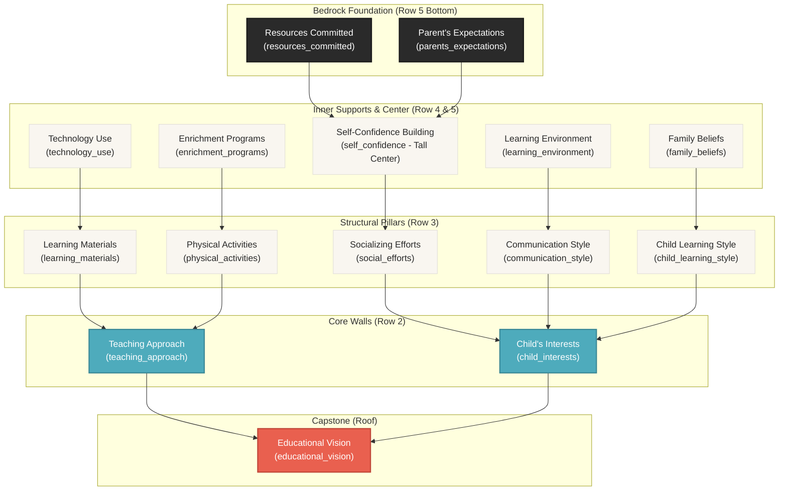
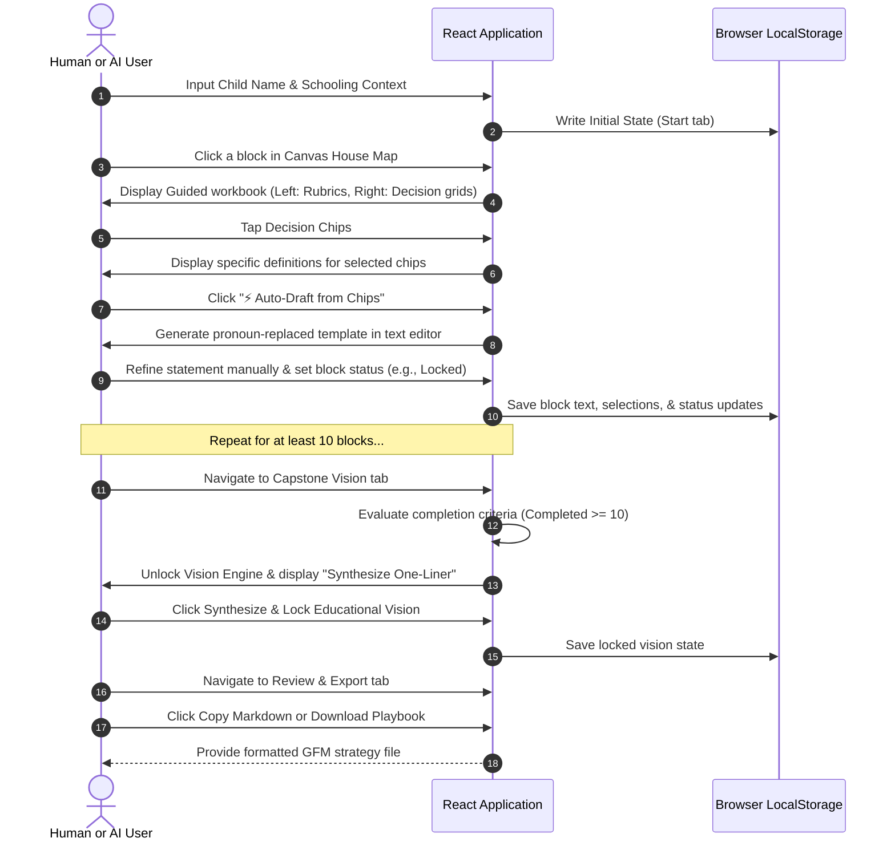
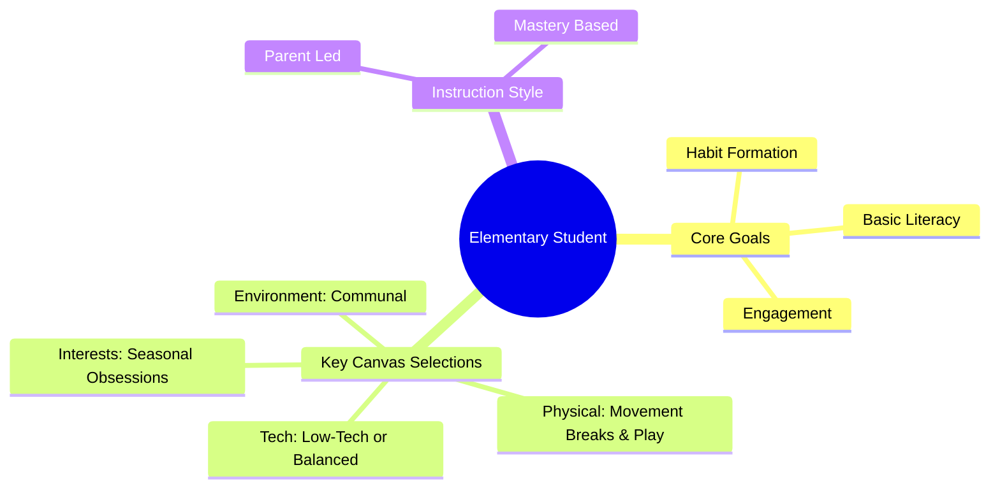
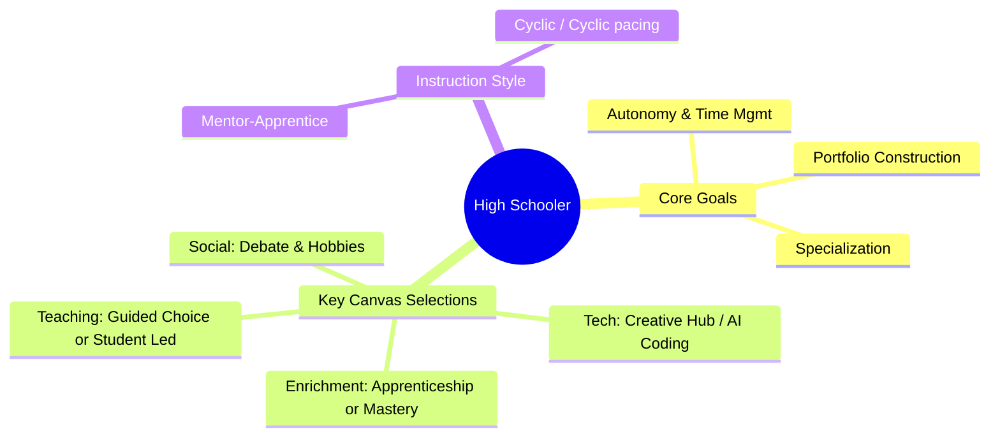
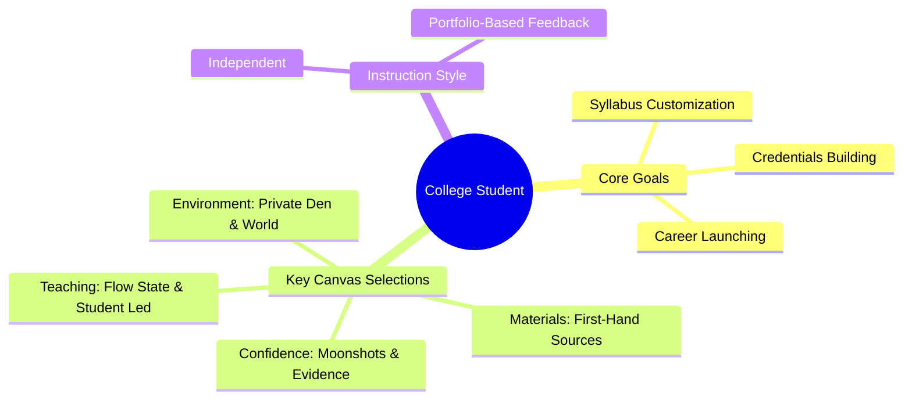
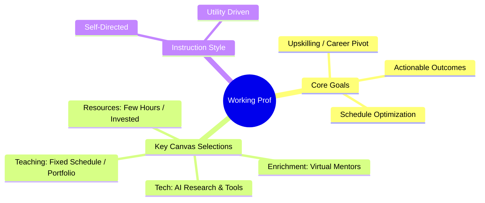
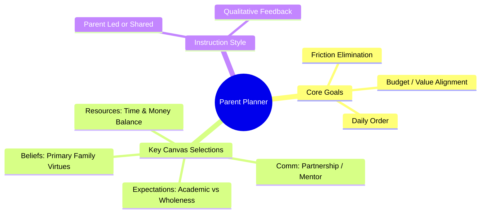

# UnCommon Core — School Model Canvas (UCC-SMC) Owner's Manual

Welcome to the **UnCommon Core — School Model Canvas (SMC)** Owner's Manual. This document is a comprehensive guide designed for both human strategic designers (parents, mentors, students, professionals) and autonomous AI agents acting as co-pilots or facilitators. 

It details the app's conceptual model, internal architecture, core features, database/state structure, and custom Jobs-to-be-Done (JTBD) profiles across multiple age groups and life stages.

---

## 1. Executive Summary & Core Metaphor

The UnCommon Core School Model Canvas is an interactive single-page strategy notebook that helps stakeholders design a personalized educational blueprint. It prevents the common pitfall of purchasing expensive curricula, apps, or school registrations before defining a clear learning philosophy, resource constraint, and target vision.

### The House Metaphor
The canvas is styled as a Greek temple or archival house:
*   **The Roof / Capstone (Educational Vision):** This block synthesizes all underlying choices into a single plain-spoken organizing sentence. The roof cannot stand without structural integrity below.
*   **The Upper Structure (Teaching Approach & Child Interests):** These represent the main load-bearing walls. They define *how* instruction is delivered and *what* naturally motivates the student.
*   **The Pillars (Materials, Physical, Social, Communication, Learning Style):** The columns that support daily operations. They bridge the gap between abstract philosophy and structural reality.
*   **The Supports & Center Pillar (Tech Use, Enrichment, Beliefs, Environment, and Self-Confidence):** Auxiliary pillars that establish boundaries and build the child's inner grit.
*   **The Foundation (Resource Commitments & Parents' Expectations):** The bedrock of time, budget, parental energy, and ultimate goals.



---

## 2. Application Architecture & Tech Stack

The application is built as an offline-first React + TypeScript client-side single-page application bundled with Vite.

### Core Files Map
*   **[types.ts](file:///c:/Users/alani/OneDrive/Documents/Vibe%20Code/UCC-school%20model%20canvas-%20notebook/src/types.ts):** Declares data models for canvas blocks, overall notebook state, and color palettes.
*   **[App.tsx](file:///c:/Users/alani/OneDrive/Documents/Vibe%20Code/UCC-school%20model%20canvas-%20notebook/src/App.tsx):** Root coordinator. Manages theme/palette initialization, tab structures, page transitions, and layouts.
*   **[usePersistence.ts](file:///c:/Users/alani/OneDrive/Documents/Vibe%20Code/UCC-school%20model%20canvas-%20notebook/src/hooks/usePersistence.ts):** React hook that stores student profile data and block content into `localStorage` under the key `ucc-school-model-canvas-state`.
*   **[blocksData.ts](file:///c:/Users/alani/OneDrive/Documents/Vibe%20Code/UCC-school%20model%20canvas-%20notebook/src/constants/blocksData.ts):** Holds the static copywriting schema, including guiding questions, example statements, templates, and multiple-choice decision chips.
*   **[BookLayout.tsx](file:///c:/Users/alani/OneDrive/Documents/Vibe%20Code/UCC-school%20model%20canvas-%20notebook/src/components/BookLayout.tsx):** Implements a double-page binder layout complete with responsive mobile selections, spine overlays, and cascading desktop side tabs.

### State Persistence Schema
The state is persisted as a single JSON object. Below is the TypeScript typing definition:

```typescript
export type BlockStatus = "empty" | "drafted" | "reviewed" | "locked";

export type CanvasBlock = {
  id: string;
  label: string;
  category: string;
  explainer: string;
  guidingQuestions: string[];
  exampleGood: string;
  exampleWeak: string;
  userText: string;
  decisionSelections: string[]; // List of active decision chip labels selected by user
  status: BlockStatus;
  updatedAt: string;
};

export type SchoolModelCanvas = {
  childName: string;
  childAge?: string;
  childGrade?: string;
  schoolingContext?: string;
  blocks: Record<string, CanvasBlock>;
  educationalVision: {
    text: string;
    generatedFromBlockIds: string[];
    manuallyEdited: boolean;
    locked: boolean;
    updatedAt: string;
  };
};
```

---

## 3. Core Features Guide

### 3.1. Double-Leaf Archival Book Binder
The app's visual structure represents a physical strategic planner.
*   **Left Page:** Displays guidelines, checklists, explainer text, strong/weak examples, and guiding questions for the active context.
*   **Right Page:** Provides interactive components (input fields, decision grids, sliders, synthesis cards, review logs).
*   **Desktop Side Tabs:** Placed outside the binder edge to permit direct tab-based navigation.
*   **Theme Palette Selection:** The header offers four custom palettes (`blossom`, `cobalt`, `sage`, and `neutral`) that apply global CSS styles to match the planner's color scheme.

### 3.2. Child Profile
Accessed in the **Start** tab. Captures basic student metadata (Name, Age, Grade/Stage, Schooling Context). Entering a student's name is **mandatory**; it is used throughout the workbook to automatically customize pronouns in draft templates.

### 3.3. Interactive Canvas Map
Laid out as a house diagram.
*   Each of the 14 building blocks acts as a button leading to its respective workbook page.
*   Displays status labels (`EMPTY`, `DRAFT`, `REVIEWED`, `LOCKED`) and truncates active user statements into quotes inside the blocks.
*   The Capstone block (**Educational Vision**) floats as the roof, reflecting completion status (e.g., `5/14 Blocks Complete`).

### 3.4. Guided Workbook Block Editor
When a block is selected:
1.  **Guiding Questions & Rubrics:** The left page populates with qualitative criteria, including a specific "Strong Statement" vs. "Weak Statement" comparison.
2.  **Decision Grids:** The right page presents 3 distinct categories with 4 mutually exclusive options (chips) each. Selecting a chip displays its definition.
3.  **⚡ Auto-Draft:** Clicking the auto-draft button merges the active selections into a pre-configured sentence template, substituting the student's name for generic placeholders.
4.  **Statement Editor:** A text area allows users to customize the auto-drafted text.
5.  **Status Badging:** Users toggle block state to lock decisions or tag them for review.

### 3.5. Capstone Vision Synthesis Engine
Located on the **Vision** tab.
*   **Locked State Guardrail:** Disabled until at least **10 of the 14** supporting blocks are completed. Shows a progressive loading bar.
*   **Automated Formula:** Once unlocked, clicking "Synthesize One-Liner" executes an algorithm mapping virtue, success type, teaching model, primary medium, and character focus to create a 180-character (max) statement.
*   **Validation Guard:** Warns the user and highlights characters if the statement exceeds the 180-character threshold.

### 3.6. Review & Export Workspace
Located on the **Review & Export** tab.
*   Provides a scrollable, unified log containing all completed block texts and selected chips.
*   Offers a one-click clipboard copy (`📋 Copy Markdown`) and a raw file downloader (`📥 Download Playbook`) that saves a `.md` markdown file naming the student and the current execution date.
*   Includes a safety-prompted `Reset Canvas` option to wipe `localStorage` and restart.



---

## 4. Jobs-to-be-Done (JTBD) Framework

The JTBD framework focuses on the primary progress a user wants to make. Below is the breakdown of how different profiles interact with the UCC-SMC.

### 4.1. Elementary Age Student (6–11 Years)
*   **Core JTBD:** "Help me discover what I naturally love and build strong core habits of focus, math/reading literacy, and physical mobility without burning me out with dry worksheets."
*   **User Dynamic:** Parent-led strategy, child-informed choices.
*   **App Usage Mapping:**
    *   **Child's Interests:** Tap *Specialist* or *Seasonal* to design learning around the child's current obsessions (e.g., dinosaurs, space, drawing).
    *   **Physical Activities:** Focus on *Free Play* or *Movement Breaks* (e.g., short bursts of activity every hour of study to keep young brains active).
    *   **Technology Use:** Select *Low-Tech* or *Balanced* to avoid digital fatigue and protect growing eyes.
    *   **Learning Environment:** Choose *Communal* (e.g., kitchen table) so parents are readily available to support.



### 4.2. High School Student (12–18 Years)
*   **Core JTBD:** "Help me transition into an autonomous young adult by teaching me how to manage my schedule, deep-dive into complex subjects, and construct a real-world portfolio that opens doors to college or careers."
*   **User Dynamic:** Co-designed with parent/mentor, or student-led.
*   **App Usage Mapping:**
    *   **Teaching Approach:** Select *Guided Choice* or *Student Led* with *Mastery Based* pacing to foster independent planning.
    *   **Enrichment Programs:** Choose *Apprenticeship* or *STEM/Arts Deep Mastery* to focus on real-world projects and portfolios.
    *   **Technology Use:** Map *Creative Hub* and *AI Tutor / Logic/Code* to leverage modern digital tools for production.
    *   **Socializing Efforts:** Target *Interest-Based* and *Debate/Logic* to find peers sharing similar obsessions.



### 4.3. College Student
*   **Core JTBD:** "Help me curate my own multidisciplinary syllabus, direct my internships, and stay focused on building actionable career credentials outside the limits of standard college classrooms."
*   **User Dynamic:** Student-designed and executed.
*   **App Usage Mapping:**
    *   **Teaching Approach:** Select *Student Led* and *Flow State* pacing to align study sessions with natural creative cycles.
    *   **Learning Materials:** Focus on *First-Hand* (primary sources, raw journals, field research) and *Minimalist* curated materials.
    *   **Self-Confidence Building:** Select *Moonshots* (big, challenging goals that might fail) and *Evidence* to track progress based on concrete output data.
    *   **Learning Environment:** Choose *Private Den* and *The World* (museums, laboratories, forests) to match independent lifestyles.



### 4.4. Working Professional
*   **Core JTBD:** "Help me organize a strict, high-efficiency upskilling strategy that fits around my demanding professional schedule so I can transition careers without losing income or wasting time."
*   **User Dynamic:** Self-designed.
*   **App Usage Mapping:**
    *   **Resources Commitment:** Constrained to *Few Hours* parent/self-time, prioritizing high *Financial Investment* in top-tier courses, software subscriptions, or coaches.
    *   **Technology Use:** Prioritize *AI Tutor / Research* and *Logic/Code* to accelerate learning speed.
    *   **Teaching Approach:** Select *Fixed Schedule* or *Cyclic* to ensure consistency around work commitments.
    *   **Enrichment Programs:** Focus on *Virtual Mentors* and *Mastery coaches* to save commute times.



### 4.5. Parents (Homeschoolers / Supplementers)
*   **Core JTBD:** "Help me align my family's educational daily agenda with our budget, personal values, and local community, removing the day-to-day stress and friction of schoolwork."
*   **User Dynamic:** Parent-led, family-centered planning.
*   **App Usage Mapping:**
    *   **Family Beliefs:** Set the system's baseline by choosing *Primary Virtues* (Agency, Curiosity, Excellence, Service) and *Risk Tolerances*.
    *   **Communication Style:** Choose *Partnership* or *Mentor/Apprentice* with *Logical Consequences* to reduce emotional arguments.
    *   **Parent's Expectations:** Align expectations (e.g., *Academic* vs. *Wholeness* and *Independent* vs. *High Support*) with actual daily availability.
    *   **Resources Commitment:** Balance budget allocations (*Low Cost*, *Invested*, *Travel*) with parent time commitments (*Immersed*, *Alternating*).



---

## 5. Instruction Manual for Human Users

Follow this checklist to build, refine, and export your strategy.

- [ ] **Step 1: Setup Child Profile**
  * Navigate to the **Start** page.
  * Enter your student's name, age, grade/stage, and current context.
  * Click `Start the Canvas`.

- [ ] **Step 2: Complete the Foundation Blocks (Bottom)**
  * It is recommended to complete the bottom foundation blocks first to set your boundary constraints.
  * Click into **Family Beliefs**, **Parent's Expectations**, and **Resources Commitment**.
  * Choose decision chips, run `⚡ Auto-Draft`, and save as `Reviewed` or `Locked`.

- [ ] **Step 3: Fill in the Outer Columns & Pillars**
  * Click through the remaining blocks in the house map (e.g., **Teaching Approach**, **Learning Materials**, **Technology Use**).
  * For each block, review the "Strong Choice" guidelines on the left page.
  * Select your decision chips and refine the statement text on the right page.

- [ ] **Step 4: Synthesize the Educational Vision Capstone**
  * Once the progress bar indicates at least **10 of the 14** supporting blocks are completed, navigate to the **Vision** tab.
  * Click `⚡ Synthesize One-Liner`.
  * Verify that the synthesized sentence is under 180 characters. Customize it manually to ensure it sounds natural.
  * Click `🔒 Lock Educational Vision`.

- [ ] **Step 5: Review, Export, and Share**
  * Head to the **Review & Export** page.
  * Scan the unified preview log.
  * Click `Download Playbook` to save your strategy as a portable Markdown file (`.md`).
  * Share the playbook with teachers, tutors, spouses, or co-parents.

---

## 6. Instruction Manual for AI Agents

When assisting a user or executing tasks autonomously within this codebase, follow these rules and system behaviors:

### 6.1. State Interpretation & LocalStorage Access
If you are analyzing user progress via logs or setting state programmatically:
*   The primary key is `ucc-school-model-canvas-state`.
*   Ensure every block in `blocks` is initialized. Do not remove default block IDs.
*   Keep the `BlockStatus` updated to reflect actions:
    *   `empty`: No user text or selections.
    *   `drafted`: Selected chips exist, or text is generated.
    *   `reviewed`: User has verified the block draft.
    *   `locked`: Confirmed selection.

### 6.2. Writing Voice & Style Guidelines
When generating text drafts or rendering synthesis recommendations:
*   **Persona:** Opinionated peer and strategic facilitator. Avoid standard corporate helper tones.
*   **Tone:** Direct, grounded, and concise. Use short sentences.
*   **Forbidden Words:** Inspirational boilerplate, therapeutic jargon, and vague buzzwords (e.g., *nurture*, *empower*, *unlock potential*, *journey*).
*   **Grammar:** Address the user in the second person ("you", "your") for rubrics, and write in the third person or first-person plural for statements ("We help Aria...").

### 6.3. Vision Synthesis Rules
The Capstone Synthesis Engine uses a strict formula:
1.  **Extract Virtue (Family Beliefs):**
    *   `Agency` $\rightarrow$ "self-directed, capable"
    *   `Curiosity` $\rightarrow$ "curious, self-reliant"
    *   `Excellence` $\rightarrow$ "resilient, high-achieving"
    *   `Service` $\rightarrow$ "service-minded, capable"
    *   *Default* $\rightarrow$ "curious, capable"
2.  **Extract Role (Parent Expectations):**
    *   `Future Self` $\rightarrow$ "adult"
    *   `Academic` $\rightarrow$ "student"
    *   `Wholeness` $\rightarrow$ "balanced learner"
    *   *Default* $\rightarrow$ "learner"
3.  **Extract Model (Teaching Approach):**
    *   `Guided Choice` $\rightarrow$ "guided-choice learning"
    *   `Student Led` $\rightarrow$ "student-led projects"
    *   `Collaborative` $\rightarrow$ "collaborative dialogue"
    *   *Default* $\rightarrow$ "structured study"
4.  **Extract Medium (Learning Materials):**
    *   `Physical Books` $\rightarrow$ "books"
    *   `Digital Core` $\rightarrow$ "curated apps"
    *   `First-Hand` $\rightarrow$ "nature and primary sources"
    *   `Hybrid` $\rightarrow$ "hybrid tools"
    *   *Default* $\rightarrow$ "quality materials"
5.  **Extract Target (Self-Confidence):**
    *   `Grit` $\rightarrow$ "mental grit"
    *   `Competence` $\rightarrow$ "competence"
    *   `Encouragement` $\rightarrow$ "confidence"
    *   *Default* $\rightarrow$ "core strengths"
6.  **Formatting Pattern:**
    `"We are helping [name] become a [virtue] [role] through [model], utilizing [material] to build [target]."`
7.  **Fallback (If statement length exceeds 180 characters):**
    `"We help [name] become a [virtue] [role] using [model] to build [target]."`

### 6.4. Handwriting Scan / Image Import Schema
If the user uploads an image scan of a physical canvas sheet:
*   Parse the image content using visual analysis.
*   Detect handwriting inside block borders.
*   Return a structured JSON output mapping parsed text directly to the 15 block IDs:
```json
{
  "educational_vision": "Synthesized capstone text...",
  "teaching_approach": "Parsed handwritten text...",
  "child_interests": "",
  "learning_materials": "Parsed text...",
  "physical_activities": "",
  "social_efforts": "",
  "communication_style": "",
  "child_learning_style": "",
  "technology_use": "",
  "enrichment_programs": "",
  "self_confidence": "",
  "family_beliefs": "",
  "learning_environment": "",
  "resources_committed": "",
  "parents_expectations": ""
}
```
*   Set any blocks not present in the image to empty strings.
